<div align="center">

# 🪐 ZeroGravity

<br/>


**3D Emotion Visualization & Personal Wellness Tracking Platform**

[](https://www.zerogv.com)


</div>

---

## 📑 Table of Contents

1. [📖 Overview](#-overview)
2. [✨ Key Features](#-key-features)
3. [🛠 Tech Stack](#-tech-stack)
4. [🏗 Architecture](#-architecture)
5. [🔧 Technical Challenges & Solutions](#-technical-challenges--solutions)
6. [🚀 Getting Started](#-getting-started)
7. [📸 Screenshots](#-screenshots)
8. [🗓 Roadmap](#-roadmap)
9. [🔗 Related](#-related)
10. [👤 Author](#-author)

---

## 📖 Overview

ZeroGravity is a personal wellness application that helps users track and visualize their emotions through an immersive 3D experience. The platform transforms emotional data into beautiful, interactive 3D planets that morph and change based on your emotional state.

> 📌 Rebuilt from an incomplete collaborative Vue project into a full-featured solo full-stack application.
> [Backend Repository](https://github.com/zerogravity-project/zerogravity-backend)

### Why ZeroGravity?

- 🎨 **Visual Emotion Tracking** - Transform abstract emotions into tangible 3D visualizations
- 📊 **Data-Driven Insights** - Analyze emotional patterns over time with interactive charts
- 🤖 **AI-Powered Insights** - Google Gemini API for emotion prediction and period analysis
- 🧩 **Cross-Platform** - Seamlessly sync between web app and Chrome extension

---

## ✨ Key Features

| Feature                    | Description                                                     | Tech                   |
| -------------------------- | --------------------------------------------------------------- | ---------------------- |
| 🌍 **3D Emotion Planets**  | Custom GLSL shaders with simplex noise, smooth lerp transitions | Three.js, R3F, GLSL    |
| 📝 **3-Step Recording**    | Emotion Level → Reason → Diary with URL-based navigation        | React Context, Next.js |
| 📅 **Responsive Calendar** | Desktop/mobile calendar with emotion detail drawer              | date-fns, Radix UI     |
| 📊 **Chart Analytics**     | Time period navigation (week/month/year) with statistics        | Chart.js               |
| 🤖 **AI Predictions**      | Emotion prediction, period analysis & insights                  | Google Gemini API      |
| 🧩 **Chrome Extension**    | New tab override synced with web app (auth & theme)             | Vite, Manifest V3      |
| 🔐 **OAuth Auth**          | Google & Kakao social login with secure session                 | NextAuth v5            |
| 🧘 **Spaceout Mode**       | Meditation feature with sequential video playback               | Next.js                |

---

## 🛠 Tech Stack

|       Category       | Technologies                                         |
| :------------------: | :--------------------------------------------------- |
|     **Frontend**     | Next.js 15 (App Router), React 19, TypeScript        |
|   **3D Graphics**    | Three.js, React Three Fiber, Custom GLSL Shaders     |
|        **AI**        | Google Gemini API                                    |
|  **Authentication**  | NextAuth v5 (Google, Kakao OAuth)                    |
| **State Management** | TanStack Query, React Context                        |
|     **Styling**      | Tailwind CSS 4, Radix UI Themes                      |
|     **Monorepo**     | pnpm Workspace                                       |
|      **Build**       | Next.js (web), Vite (extension, shared library mode) |
|  **Infrastructure**  | Docker, Docker Compose, Nginx                        |
|      **CI/CD**       | GitHub Actions (Zero-Downtime, Auto-Rollback)        |
|     **Testing**      | Playwright (E2E), Jest                               |

---

## 🏗 Architecture

```
zerogravity-react/
├── packages/
│   ├── web/              # Next.js 15 Web Application
│   │   ├── src/app/      # App Router with route groups
│   │   │   ├── (public)/    # Home, Terms
│   │   │   ├── (auth)/      # Login
│   │   │   ├── (protected)/ # Record, Profile, Spaceout
│   │   │   └── (api)/       # Route Handlers (Auth, Proxy, Health)
│   │   ├── src/services/ # API service layer (dto/query/service)
│   │   └── src/lib/      # Auth, Axios configuration
│   │
│   ├── extension/        # Chrome Extension (Manifest V3)
│   │   ├── src/lib/      # Chrome Cookies API integration
│   │   └── public/       # Extension manifest & assets
│   │
│   └── shared/           # Shared Library
│       ├── entities/     # Domain constants & types (zero deps)
│       ├── components/   # UI components (Clock, Navigation, etc.)
│       │   └── ui/emotion/ # 3D Planet with GLSL shaders
│       ├── hooks/        # Shared React hooks
│       └── utils/        # Utility functions
│
├── .github/workflows/    # CI/CD (deploy, build-extension)
├── pnpm-workspace.yaml   # Monorepo configuration
└── package.json          # Root dependencies
```

### Why Monorepo?

**🔍 The Challenge**: Chrome Extensions don't support SSR, making Next.js unusable for the extension. The goal was to let users see their emotion planet right from the new tab, sharing the same 3D planet and UI components with the web app.

**💡 The Solution**: Created a shared package (Vite library mode) instead of migrating the entire project to Vite, preserving Next.js benefits for the web app.

**✅ The Result**:

- **`packages/web`**: Full Next.js app with SSR, auth, and all features
- **`packages/extension`**: Lightweight Vite build for Chrome new tab
- **`packages/shared`**: Common components used by both (3D planet, clock, theme)

---

## 🔧 Technical Challenges & Solutions

### 1. 3D Rendering Optimization (29fps → 61fps)

**🔍 Problem**: Emotion planet rendered at 29fps with 408,040 triangles. The landing page felt heavy on every visit

**💡 Solution**:

- **Shader simplification**: Removed unnecessary vertex displacement (surface wobble) and kept only color animation, reducing noise calls from 6 to 2 per vertex
- **LOD (Level of Detail)**: Tuned subdivision per context
  - Large Planet (Home): 100→48 (desktop), 32 (mobile)
  - Normal Planet (Record, Calendar): 50→32 (desktop), 28 (mobile)

**✅ Outcome**: ~610K → ~48K noise calls per frame (**-92%**), 408K → 48K triangles (**-88%**), **29fps → 61fps**

```glsl
// Before — 6 noise calls per vertex (vertex displacement + normal recalculation)
void main() {
  float wobble = getWobble(csm_Position);      // 2 noise (self)
  positionA += getWobble(positionA) * normal;   // 2 noise (neighbor A)
  positionB += getWobble(positionB) * normal;   // 2 noise (neighbor B)
  csm_Normal = normalize(cross(toA, toB));
}

// After — 2 noise calls per vertex (color animation only)
void main() {
  float noise = getWobble(csm_Position);  // 2 noise (single call)
  vWobble = noise;
}
```

### 2. Bundle Optimization (First Load JS -58%)

**🔍 Problem**: Three.js (712KB) loaded on every page, even the chart page that uses zero 3D. Lighthouse Performance scored 27-71 across pages. Barrel export bundled emotion constants and 3D components together, so importing a single constant pulled in Three.js

**💡 Solution**:

- **Entity/Component separation**: Split domain data (names, colors, types, zero deps, ~28 importers) from 3D rendering (Three.js, R3F, GLSL, 712KB)
- **React.lazy**: Lazy-load 3D canvas with static placeholder images (7 emotions × 3 sizes) for instant visual feedback

**✅ Outcome**:

- Home 447→187KB (**-58%**), Record 514→254KB (**-51%**), Calendar 514→256KB (**-50%**)
- Lighthouse Performance: non-3D pages 66-69 → **97** (desktop)

```
// Before — single barrel bundles everything
emotion/index.ts
├── export * from './constants'    → EMOTION_STEPS, etc. (pure JS)
├── export * from './scene'        → EmotionPlanetScene (Three.js 712KB)
└── export * from './decorations'

// After — separated by dependency weight
entities/emotion/   → Domain data (zero deps, SSR-safe)
components/emotion/ → 3D rendering (Three.js, lazy-loaded)
```

### 3. Cross-Context Authentication (Web ↔ Extension)

**🔍 Problem**: Chrome Extension needs to access NextAuth session from web app without separate login

**💡 Solution**:

- Chrome Cookies API reads NextAuth session cookies
- Validates session by sending cookie to NextAuth `/api/auth/session` endpoint

**✅ Outcome**: Seamless authentication. Login once on web, automatically authenticated in extension

```typescript
// 1. Read NextAuth session cookie from Chrome cookie store
const cookie = await chrome.cookies.get({
  url: WEB_APP_URL,
  name: '__Secure-authjs.session-token',
});

// 2. Validate session via NextAuth endpoint
const response = await fetch(`${WEB_APP_URL}/api/auth/session`, {
  credentials: 'include',
});
const session = await response.json();
// NextAuth returns {} if no session, { user: {...} } if valid
```

### 4. E2E Testing for 3D Apps (Playwright)

**🔍 Problem**: Running 246 E2E tests in parallel caused GPU resource contention from WebGL/Canvas tests, making them flaky. Had to fall back to fully sequential execution, significantly increasing total run time

**💡 Solution**: Isolate WebGL tests into `chromium-3d` (sequential) to prevent GPU contention, while `chromium` (non-WebGL) runs in parallel

**✅ Outcome**: Fully sequential (22min) → selective parallel (9min, **-59%**), stable

```typescript
// playwright.config.ts — Project separation
fullyParallel: true,
projects: [
  {
    name: 'chromium-3d',
    testMatch: [/.*home.*/, /.*record-daily.*/, /.*spaceout.*/],
    fullyParallel: false,  // Sequential — prevent GPU contention
  },
  {
    name: 'chromium',
    testIgnore: [/.*home.*/, /.*record-daily.*/, /.*spaceout.*/],
    // Inherits fullyParallel: true — safe without WebGL
  },
],
```

---

## 🚀 Getting Started

### Prerequisites

- Node.js >= 18
- pnpm >= 8

### Installation

```bash
# Clone the repository
git clone https://github.com/zerogravity-project/zerogravity-react.git
cd zerogravity-react

# Install dependencies
pnpm install

# Set up environment variables
cp packages/web/.env.example packages/web/.env.local
```

### Development

```bash
# Start web application
pnpm dev:web          # http://localhost:3000

# Start extension development
pnpm dev:extension    # Load unpacked from packages/extension/dist

# Build all packages
pnpm build:all

# Type check
pnpm type-check:all

# Lint
pnpm lint:all
```

### Environment Variables

```env
# NextAuth Configuration
AUTH_SECRET=your-secret
AUTH_URL=http://localhost:3000
AUTH_GOOGLE_ID=your-google-client-id
AUTH_GOOGLE_SECRET=your-google-client-secret
AUTH_KAKAO_ID=your-kakao-client-id
AUTH_KAKAO_SECRET=your-kakao-client-secret

# Backend API
NEXT_PUBLIC_API_BASE_URL=https://api.zerogv.com
```

---

## 📸 Screenshots

> Responsive design across all pages - Desktop and Mobile views

### 🏠 Home & Login

Main landing page with interactive 3D emotion planet and OAuth login.

<table>
<tr>
<th width="10%"></th>
<th width="69%" align="center">Desktop</th>
<th width="21%" align="center">Mobile</th>
</tr>
<tr>
<td align="center"><b>Home</b></td>
<td align="center"></td>
<td align="center"></td>
</tr>
<tr>
<td align="center"><b>Login</b></td>
<td align="center">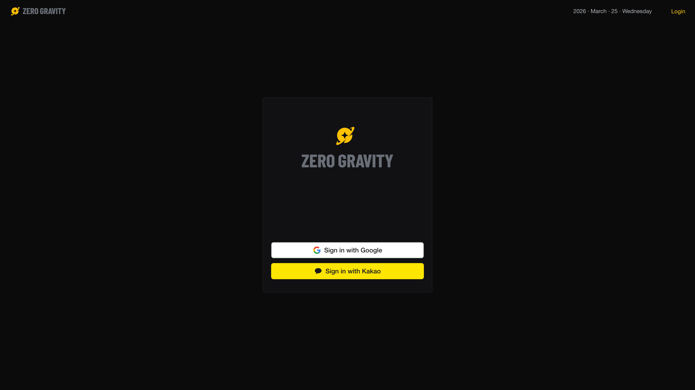</td>
<td align="center">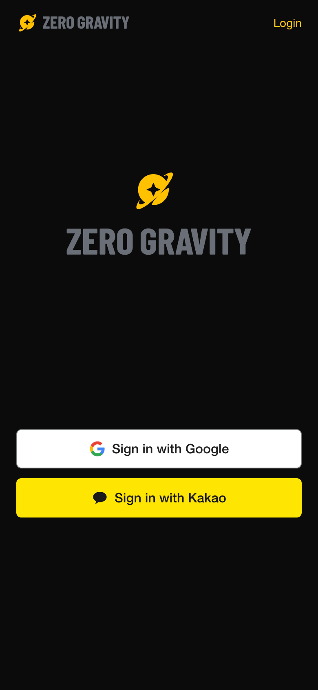</td>
</tr>
</table>

- **Home**: Interactive 3D planet visualization with real-time emotion color mapping
- **Login**: Google & Kakao OAuth social login

### 🧘 Onboarding (Spaceout)

Optional meditation flow before emotion recording - helps users relax and reflect.

<table>
<tr>
<th width="10%"></th>
<th width="90%" align="center">Desktop</th>
</tr>
<tr>
<td align="center"><b>Spaceout</b></td>
<td align="center"></td>
</tr>
</table>

- **Spaceout**: Choose to enter spaceout mode or skip to recording, with sequential meditation videos

### 📝 Emotion Recording

3-step emotion recording flow with AI-powered suggestions.

<table>
<tr>
<th width="10%"></th>
<th width="69%" align="center">Desktop</th>
<th width="21%" align="center">Mobile</th>
</tr>
<tr>
<td align="center"><b>Record</b></td>
<td align="center">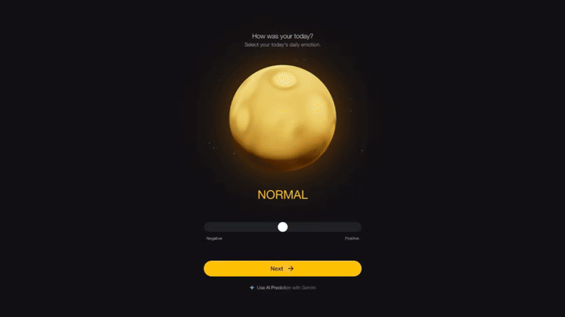</td>
<td align="center">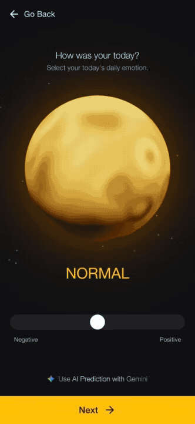</td>
</tr>
</table>

- **Step 1**: Select emotion level (1-7) with real-time 3D planet preview
- **Step 2**: Choose reasons for your emotion from predefined categories
- **Step 3**: Write diary entry with optional AI emotion prediction

### 📊 Analytics

Track and analyze emotional patterns over time.

<table>
<tr>
<th width="10%"></th>
<th width="69%" align="center">Desktop</th>
<th width="21%" align="center">Mobile</th>
</tr>
<tr>
<td align="center"><b>Calendar</b></td>
<td align="center">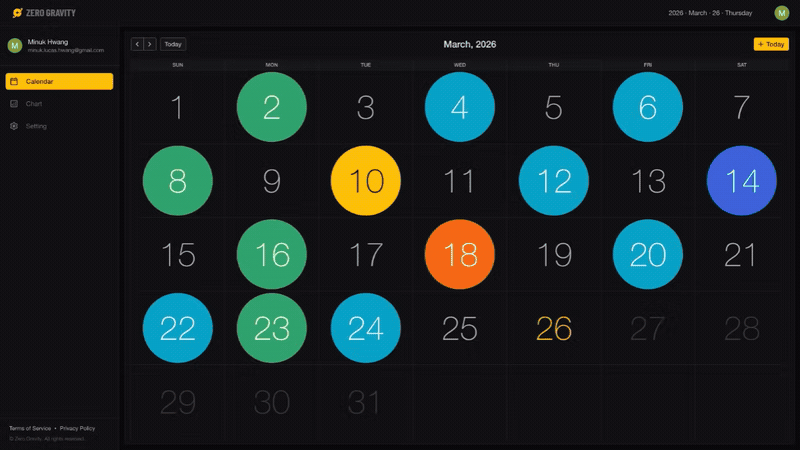</td>
<td align="center">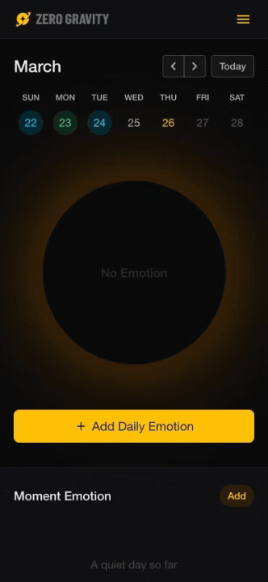</td>
</tr>
<tr>
<td align="center"><b>Chart</b></td>
<td align="center">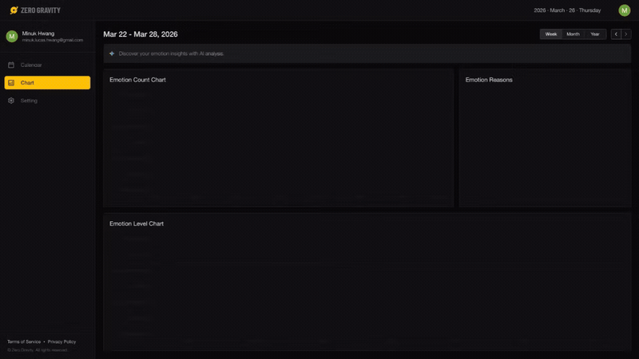</td>
<td align="center">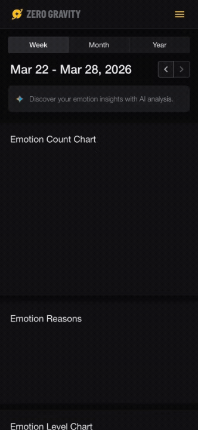</td>
</tr>
</table>

- **Calendar**: Monthly view with emotion indicators, detail drawer on date selection
- **Chart**: Week/month/year statistics with emotion counts, levels, and reasons

### 🤖 AI Features

Gemini-powered intelligent emotion analysis.

<table>
<tr>
<th width="10%"></th>
<th width="69%" align="center">Desktop</th>
<th width="21%" align="center">Mobile</th>
</tr>
<tr>
<td align="center"><b>Emotion Prediction</b></td>
<td align="center">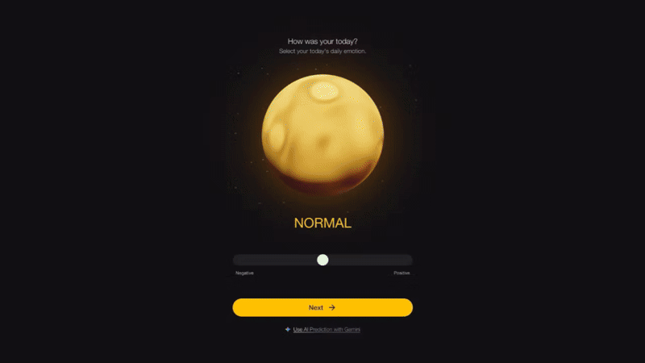</td>
<td align="center">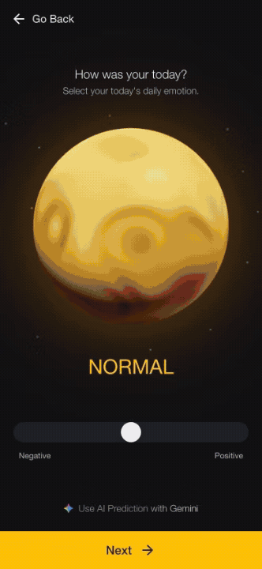</td>
</tr>
<tr>
<td align="center"><b>Period Analysis</b></td>
<td align="center">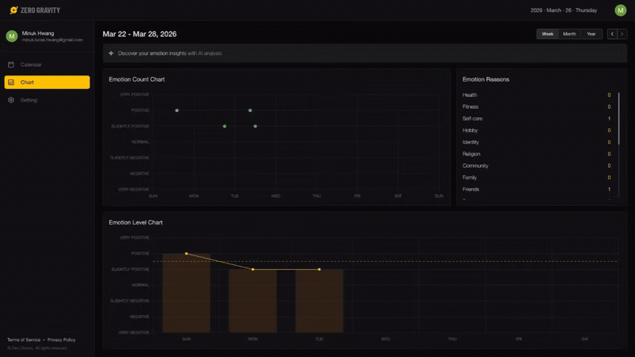</td>
<td align="center">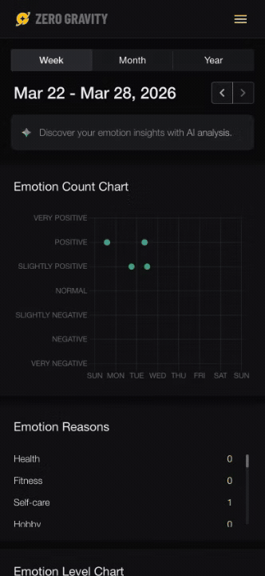</td>
</tr>
</table>

- **Emotion Prediction**: AI suggests emotions based on diary content
- **Period Analysis**: Weekly/monthly/yearly emotion pattern insights

---

## 🗓 Roadmap

- [ ] Chat-based emotion analysis with AI
- [ ] Chrome Extension: additional views beyond landing (calendar, chart)
- [ ] Multi-language support (i18n)

---

## 🔗 Related

- 🌐 [Read more on my portfolio →](https://minukhwang.com/projects/zerogravity-frontend)
- 🚀 [Backend (Spring Boot)](https://github.com/zerogravity-project/zerogravity-backend)

---

## 👤 Author

**Minuk Hwang** - Fullstack Developer

- 🌐 [Portfolio](https://www.minukhwang.com)
- 💼 [LinkedIn](https://linkedin.com/in/minuk-hwang-934999157)
- 📧 [minuk.lucas.hwang@gmail.com](mailto:minuk.lucas.hwang@gmail.com)
